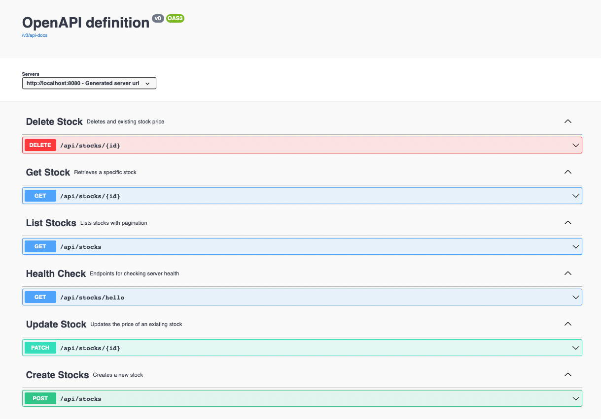

# Stock API

This repository implements a simple stock repository focused on basic CRUD operations that is backed by a MySQL database.

## Pre-requisites

- Java 11+
- Maven 3.8+
- MySQL 8+

## How to Build

Navigate to the project root directory and run the following command.

`mvn clean install`

## How to Run

- Update the `src/main/resources/application.properties` file DB connection details.
- For the initial run set value `spring.jpa.hibernate.ddl-auto=create`
- Once the DB is created in the initial run, set the value `spring.jpa.hibernate.ddl-auto=update`.
  This will pre-populate data.
- Navigate to the project root directory and run the following command.
  
`mvn spring-boot:run`

## How to Test

This exposes a set of API Endpoints which deals with CRUD operations for stocs.

1. Verify if the server is running. Navigate to `http://localhost:8080/api/stocks/hello`
2. This will return HTTP 200 status response with message body `Hello`

## API Documentation (OpenAPI)

Navigate to `http://localhost:8080/swagger-ui.html`.
This will display the Swagger UI which utilizes Open API documentation to visualize API documentation.

- GET `/api/stocks/hello`

Endpoints for checking server health

- DELETE
`/api/stocks/{id}`

Deletes and existing stock price

- GET `/api/stocks/{id}`

Retrieves a specific stock

- GET `/api/stocks`

Lists stocks with pagination

- PATCH `/api/stocks/{id}`

Updates the price of an existing stock

- POST `/api/stocks`

Creates a new stock

